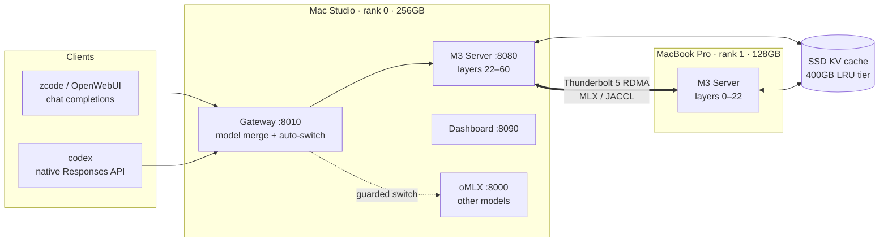

# ⚡ ThunderMLX

**Run a 456B-parameter frontier MoE on your desk.** ThunderMLX turns two
Apple Silicon Macs connected by Thunderbolt 5 into a single, production-grade
inference machine serving **MiniMax-M3** — with an OpenAI-compatible API,
agent-ready tool calling, live thinking streams, tiered KV caching, and
one-click desktop operation.

Neither machine can hold the model alone. Together — a 256GB Mac Studio and a
128GB MacBook Pro, pipeline-split over MLX/JACCL RDMA — they serve ~220GB of
4-bit weights at interactive speeds, around the clock, as an always-on local
endpoint that real coding agents hammer all day.



## Measured performance

All numbers measured on the reference pair (M3 Ultra Studio 256GB +
M5 Max MacBook Pro 128GB, TB5), MiniMax-M3-4bit, real client traffic:

| Metric | Result |
| --- | --- |
| Cold prefill ladder (final candidate) | **367.94 tok/s @ 30.6k · 356.93 @ 81.9k · 337.45 @ 199.8k · 273.56 @ 353.6k** |
| Cached decode ladder | **26.25 tok/s @ 30.6k · 25.48 @ 81.9k · 23.81 @ 199.8k · 20.96 @ 353.6k** |
| Short-turn decode | **~30-32 tok/s** (thinking and no-think) |
| Sustained long generation | **24.5 tok/s** over a 10,000-token completion |
| Decode at 19k / 35k context (fused sparse decode) | **24.9 / 23.1 tok/s** — near-flat with context (was 20 / 17 dense) |
| Live agent turns, 6-7k-token tool writes | 26-27 tok/s sustained |
| Warm-turn TTFT | **0.65–1.2 s** |
| Hot-cache agent turns | 1,000–36,000 tok/s effective prefill |
| Cancelled-stream retry (agent timeout) | full cache kept → **0.87 s** TTFT on retry |
| 36k-token session, cold vs hot | 170 s → **5.9 s** TTFT (~29× from KV reuse) |
| Restart recovery (SSD tier) | **0.86 s @ 46.6k · 7.07 s @ 354k** restore TTFT |
| In-flight stop → slot released | **< 1–8 s**, from any client, zero orphans; prefill aborts within one 4k chunk |
| Model swap (M3 ⇄ oMLX) | ~45 s round trip, guarded |
| Output budget / KV ceiling | 32k tokens / 1M-token KV |

**Why these numbers matter compared to a "standard" setup:** a single
consumer Mac cannot load the model at all, and a naive two-box pipeline gets
you a fragile demo — first tokens in minutes on long sessions (no KV
tiering), agents that strand GPU memory when you cancel them (reboots), and
distributed wedges under load. ThunderMLX's value is that the fast path and
the reliability path are the *same* path, proven by soak batteries and weeks
of real agentic use.

## Feature suite

- 🔌 **OpenAI-compatible** `/v1/chat/completions` **and native
  `/v1/responses`** — codex connects directly, thinking renders as
  first-class reasoning items, tool calls stream as `function_call` items
- 🧠 **Live thinking** — reasoning deltas stream token-by-token on every
  wire, including during tool-bearing agent turns
- 🛠️ **Agent-grade tool calling** — native `mlx-vlm` tool emission first,
  OpenAI `tool_choice` auto/none/required/named semantics, parallel calls and
  streamed args, with narrowly evidenced repairs only for structurally invalid
  calls; completed calls stop decode without exposing raw MiniMax markup
- 🗄️ **Tiered prompt/KV cache** — hot RAM residents with keepwarm → SSD
  (5-day TTL, 400GB LRU, per-rank) → re-prefill; sessions survive restarts;
  strict per-session isolation
- 🛑 **True in-flight cancel** — `/v1/stop`, client disconnect, or a codex
  Esc all stop distributed generation inside a few tokens and release the
  slot, on both ranks, without orphaning wired Metal memory
- 🔀 **Guarded model auto-switch** — request an oMLX-hosted model and the
  gateway swaps backends (never while M3 is busy or recently active), then
  auto-starts M3 back on demand
- 📊 **Live dashboard** — per-request phase, tokens, cache hits, TTFT
  breakdown, wired-memory health for both ranks, plus a Sessions tab with an
  exact request-bound cancel control and recent-request history
- 🖱️ **One-click ops** — `M3_Start` / `M3_Stop` / `M3_Restore_Gold` desktop
  commands: full-stack boot with crash-self-healing supervisor, graceful
  teardown with orphan check, and a tagged known-good restore point
- 🐕 **Defense in depth** — frozen-prefill watchdog, decode-stall reaper,
  degenerate-output classifier, prefix-plan consensus (kills a whole class
  of RDMA wedges), self-healing generation locks, lifetime stats that
  persist across reboots

## Client compatibility (certified)

| Client | Wire | Thinking | Tools | Stops |
| --- | --- | --- | --- | --- |
| zcode | chat completions | ✅ live stream | ✅ | ✅ |
| OpenCode | chat completions | ✅ live stream | ✅ multi-file loops | ✅ |
| OpenWebUI | chat completions | ✅ live stream | ✅ | ✅ |
| codex | native Responses | ✅ reasoning items | ✅ | ✅ |
| Claude Code | Anthropic Messages | ✅ thinking blocks | ✅ extended loop | ✅ |
| Any OpenAI SDK | either | ✅ | ✅ | ✅ |

The 2026-07-12 native-first release gate ran five alternating thinking and
no-thinking Claude Code suites: 76 inference requests, more than 50 real tool
actions, zero failed requests, no leaked active slot, and clean wired-memory
release after every stop. The same build passed Codex Responses file writes,
OpenAI streaming/non-streaming tool calls, OpenWebUI-shaped history, image
input, and client-disconnect recovery.

The July 13 ZCode gate then exercised the actual desktop client for more than
30 minutes: roughly 1,275 server requests, hundreds of tool-bearing turns, a
67k-token working context, multi-file Python edits, shell validation, DOCX/PDF
generation, cancellation, and recovery from oversized-write retries. A final
fresh ZCode workflow created two files, ran its verifier, reused the 8.3k-token
tool prefix at 5,300-6,500 effective prompt tok/s, and finalized normally.
Repeated identical command/result pairs now end the affected agent turn after
four unchanged results instead of looping forever; productive reruns with
changing output remain untouched.

The July 14 native-path gate removed the compatibility primer, semantic
no-call caps, and full-turn buffering from production defaults. Fresh ZCode
thinking and no-thinking tasks both completed native Read/Write/Bash/Edit
chains, streamed without raw XML leakage, and finished healthy. A 25.9k-token
tool session cold-prefilled at 351.9 tok/s, reused more than 99% of its prefix
across follow-up calls, and decoded at 24-25 tok/s. OpenAI streaming and
non-streaming tools, Anthropic `tool_use`, and Codex Responses/schema probes
all passed; the legacy compatibility overlay remains opt-in for diagnostics.

The final July 14 qualification isolated structured decode from the prose
speed approximation. Tool-bearing requests now select MSA blocks exactly on
every token, while ordinary chat keeps decode top-k reuse `48`. Fresh thinking
and no-thinking OpenCode projects finished 14-17 real agent steps and passed
18/18 and 22/22 generated tests. The installed ZCode 0.15.2 harness then
completed separate native-tool goals in both modes and independently passed
7/7 and 8/8 generated tests. Four alternating extended Claude Code suites
added 56 clean inference requests in a ten-minute soak. OpenWebUI-shaped
34-tool follow-ups reached `0.25s` no-thinking and `0.65s` thinking TTFT;
ordinary short decode remained `31.99 tok/s`. See
[docs/NATIVE-TOOLS-2026-07-14.md](docs/NATIVE-TOOLS-2026-07-14.md) for the root
cause, exact gates, and rollback knobs.

## Quick Start

> 🤖 **Setting up with an AI agent?** Hand your agent
> [docs/AGENT_SETUP.md](docs/AGENT_SETUP.md) — a guided procedure where the
> agent discovers your hardware, installs dependencies, asks you the human
> questions (model location, pipeline split), and boots + verifies the
> cluster for you.


This project assumes two Apple Silicon Macs with SSH between them and a local
MiniMax-M3 MLX model.

1. Clone the repo on the primary Mac:

   ```bash
   git clone https://github.com/jonathan308/ThunderMLX.git
   cd ThunderMLX
   ```

2. Copy the example config:

   ```bash
   cp .env.example .env.local
   ```

3. Edit `.env.local` for your machines:

   ```bash
   M3_RANK1_DIRECT_SSH=worker.local
   M3_RANK0_DATA_IP=primary.local
   M3_RANK1_DATA_IP=worker.local
   M3_MLX_BACKEND=jaccl
   M3_PIPELINE_LAYERS=38,22

   MLX_M3_MODEL=/path/to/mlx-community--MiniMax-M3-4bit
   MLX_M3_MODEL_ID=mlx-community/MiniMax-M3-4bit
   ```

   Keep `.env.local` private. It is ignored by git.

4. Sync source to the worker:

   ```bash
   ./sync_rank1.sh
   ```

5. Start the cluster:

   ```bash
   open ./M3_Start.command
   ```

6. Open the dashboard:

   ```text
   http://127.0.0.1:8090
   ```

   The Models tab checks runtime versions on both ranks. `Update MLX-VLM`
   stages exact MLX-VLM, MLX-LM, and Transformers release wheels as one
   rollback unit, preserves the custom MLX core, updates both ranks, reapplies
   runtime patches, validates dependencies, and restarts the managed cluster.
   `Update MLX` accepts only the production-validated paired
   MLX/MLX-Metal build declared in `runtime_patches/mlx_variants.json`; it runs
   kernel known-answer checks on both Macs and restores the previous pair if a
   validation step fails.

   The Sessions tab shows the active request, phase, context, generated tokens,
   cache reuse, queue state, and recent requests. `Cancel request` targets the
   request ID currently shown; if that request finishes before the click
   arrives, the server returns `409` and does not cancel the next request.

7. Connect clients to:

   ```text
   http://<primary-mac>:8080/v1
   ```

   Or, when you want one model list that includes both ThunderMLX MiniMax-M3 and
   oMLX models, connect clients to the arbiter gateway:

   ```text
   http://<primary-mac>:8010/v1
   ```

   Requests for `Minimax-M3`, `Minimax-M3-No-Think`, and `M3-Web` route to the
   ThunderMLX cluster. `Claude-Code` and `Claude-Code-Sonnet` invoke the local
   Claude Code CLI if installed. Other model ids route to oMLX on port `8000`.
   With `M3_GATEWAY_AUTO_SWITCH=1`, the gateway stops M3 before forwarding oMLX
   requests and unloads loaded oMLX models before starting M3 again.

   For coding agents, use `Minimax-M3-No-Think` with a 300k context window and
   16,384 max output tokens (the gateway advertises 300k via
   `M3_GATEWAY_ADVERTISED_MAX_MODEL_LEN` so shims compact early enough for
   stable long agent runs). Use `Minimax-M3` or `M3-Web` for thinking chat,
   image understanding, and OpenWebUI-style sessions; the MiniMax endpoint
   supports up to the native 1M context when the client can preserve the
   transcript cleanly.

   Codex/Responses clients should use the arbiter gateway with the Responses
   wire API and a 300k context window, e.g. in `~/.codex/config.toml`:

   ```toml
   [model_providers.thundermlx]
   name = "ThunderMLX"
   base_url = "http://<primary-mac>:8010/v1"
   env_key = "OPENAI_API_KEY"
   wire_api = "responses"
   requires_openai_auth = false

   [profiles.minimax]
   model_provider = "thundermlx"
   model = "Minimax-M3-No-Think"
   model_context_window = 300000
   model_max_output_tokens = 16384
   ```

   Then run `codex -p minimax` (or a `minimax-thinking` profile with
   `model = "Minimax-M3"`).

   Claude Code/Anthropic-style clients should use the same gateway without the
   `/v1` suffix as the base URL:

   ```text
   ANTHROPIC_BASE_URL=http://<primary-mac>:8010
   ANTHROPIC_AUTH_TOKEN=local
   ANTHROPIC_MODEL=Minimax-M3-No-Think
   ANTHROPIC_SMALL_FAST_MODEL=Minimax-M3-No-Think
   ```

For full blank-slate setup, see [docs/SETUP.md](docs/SETUP.md).

## Reference Hardware

The current benchmark numbers in this repository come from one reference
two-Mac setup:

- Rank 0 / primary: high-memory Mac Studio-class Apple Silicon system.
- Rank 1 / worker: high-memory MacBook Pro-class Apple Silicon system.
- Direct local data link: Thunderbolt/JACCL/RDMA.
- MiniMax-M3 Q4 with the `38,22` pipeline split. Split values are ordered
  `rank0,rank1`: the primary owns the final 38 layers and API, while the worker
  owns the initial 22 layers and embeddings.

That setup is only a reference baseline, not a requirement. Other Macs, memory
sizes, storage layouts, network interfaces, and model locations should be
configured in `.env.local`. Re-benchmark `M3_PIPELINE_LAYERS`, wired-memory
limits, SSD-cache paths, and decode/prefill knobs for your own hardware before
treating the defaults as production values.

## Recommended Defaults

The checked-in defaults are conservative for a high-memory two-Mac MiniMax-M3
cluster. Override them in `.env.local` for your own hardware.

```bash
M3_PIPELINE_LAYERS=38,22
MLX_M3_PREFILL_STEP_SIZE=4096
MLX_M3_PREFILL_STOP_CHECK_EVERY=0
MLX_M3_SPARSE_TOPK_BLOCKS_OVERRIDE=16
MLX_M3_DECODE_TOPK_REUSE_TOKENS=48
MLX_M3_DEFAULT_TEMPERATURE=0.2
MLX_M3_MAX_CONCURRENT_REQUESTS=1
MLX_M3_PROMPT_CACHE=1
MLX_M3_PROMPT_CACHE_THINKING_MODE=visible
MLX_M3_IMAGE_PROMPT_CACHE=0
MLX_M3_PROMPT_CACHE_RESIDENT_SLOTS=2
MLX_M3_PROMPT_CACHE_RESIDENT_MAX_TOTAL_TOKENS=750000
```

The resident-token budget limits extra parked RAM caches, not the active
request's context window. An active long session can still use the configured
model context; sessions that cannot be parked within a rank's resident budget
fall back to SSD persistence or cold prefill when revisited.

The portable `.env.example` leaves SSD cache disabled by default. Enable it only
after validating your storage paths:

```bash
MLX_M3_PROMPT_CACHE_SSD=1
MLX_M3_PROMPT_CACHE_SSD_RESTORE=1
MLX_M3_PROMPT_CACHE_SSD_AUTO_SAVE=0
MLX_M3_PROMPT_CACHE_SSD_AUTO_SAVE_MIN_DELTA_TOKENS=8192
```

See [docs/PERSISTENT_CACHE.md](docs/PERSISTENT_CACHE.md) for cache behavior,
privacy notes, pruning, and restore validation.

Image-bearing prompt/KV reuse is a separate acceptance-gated feature. With
`MLX_M3_IMAGE_PROMPT_CACHE=1`, ThunderMLX keys an image session by the ordered
SHA-256 hashes of the exact image bytes, the loaded processor contract, and the
expanded media-token layout. A cache prefix is reusable only after the final
media token, so the uncached suffix is text-only. Changed bytes, image order,
processor/runtime metadata, token layout, or rank disagreement always produces
a coordinated cold fallback; raw image bytes are never written to cache
metadata. Keep this flag off on new hardware until
`probes/m3_multimodal_cache_smoke.py` and the live two-rank image ladder pass.

## Custom Runtime And Kernel Work

ThunderMLX is not only a thin OpenAI wrapper around MiniMax-M3. The current
reference build includes targeted MiniMax-M3 runtime and kernel-path work for
distributed Apple Silicon inference:

- A local MiniMax Sparse Attention / MSA overlay under `MSA Support/`.
- Custom MLX Metal kernels in
  `MSA Support/mlx_vlm/models/minimax_m3_vl/msa.py`.
- Steel MMA K1 sparse-attention path, with SIMD, packed SIMD, and scalar
  fallback implementations.
- Memory-bounded blockwise grouped MSA top-k construction for long prefill.
- Sparse decode path and decode top-k reuse, currently tuned with
  `MLX_M3_DECODE_TOPK_REUSE_TOKENS=48`.
- Request-scoped exact MSA selection for structured tool output, controlled by
  `MLX_M3_TOOL_DECODE_TOPK_REUSE_TOKENS=0`; the faster chat value is restored
  immediately after each tool-bearing request.
- Sparse top-k override tuning, currently `MLX_M3_SPARSE_TOPK_BLOCKS_OVERRIDE=16`.
- Split-verify attention kernel for speculative verify blocks (2<=L<=8):
  per-query sparse history + dense causal tail, LSE-merged (gated behind
  `MLX_M3_SPLIT_VERIFY`, off by default).
- Capture-only training-data mode: normal generation optionally dumps
  drafter-training pairs (<1% overhead, `MLX_M3_EAGLE3_CAPTURE_ONLY`).
- Dashboard Storage card: live usage-vs-cap bars and runtime-tunable
  limits for the SSD prompt-KV cache and capture corpus.
- Compact decode sorting disabled by default after benchmarking:
  `MLX_M3_COMPACT_DECODE_SORT_TOPK=0`.
- Direct decode kernel hooks are present but disabled by default because the
  current stable path is faster and safer on the reference cluster.
- Distributed pipeline ownership patches for the asymmetric two-Mac split,
  including rank-0 logits/decode ownership and sampled-token synchronization.
- MLX command-buffer and prefill cadence tuning:
  `MLX_MAX_OPS_PER_BUFFER=16`, `MLX_MAX_MB_PER_BUFFER=512`,
  `MLX_M3_PREFILL_STEP_SIZE=4096`, and normal-request prefill stop checks off.

In short: the server/gateway is part of the project, but the speed baseline also
depends on the custom MSA kernels, sparse decode reuse, cache behavior, and
rank-synchronization patches. Do not replace `MSA Support/` with vanilla
upstream files unless you have benchmarked the change and preserved the
stability gates.

## Validation

Useful smoke tests against a running endpoint:

```bash
python3 probes/m3_tool_call_smoke.py --base http://127.0.0.1:8080
python3 probes/m3_openai_multitool_live_probe.py --base http://127.0.0.1:8010/v1
python3 probes/m3_image_smoke.py --base http://127.0.0.1:8080
python3 probes/m3_tool_prefix_reuse_probe.py --base http://127.0.0.1:8080
python3 probes/m3_agent_staged_suffix_probe.py --base http://127.0.0.1:8080
python3 probes/m3_prefill_shape_probe.py --base http://127.0.0.1:8080
```

Current selected stability-first baseline on the reference `38,22`
Thunderbolt/JACCL cluster:

- 16k-class cold prefill: about `374 prompt tok/s`.
- 48k actual tokens: about `353-368 prompt tok/s` across cold/repeat runs.
- 131k actual tokens: about `318-321 prompt tok/s`.
- Short/tool decode: about `31-32 tok/s`; 256k cached decode: about
  `22.3 tok/s`.
- Short hot tool-prefix turns: about `0.19-0.23s` server TTFT.
- Faster native/cancel-cadence experiments are intentionally not promoted
  because they failed in-flight stop or long-prefill disconnect gates.
- Tool calls, image input, thinking routing, hot cache, and SSD restore have
  dedicated probes under `probes/`.

Benchmark and probe tooling lives under
`probes/` and `ops/`; see [docs/SETUP.md](docs/SETUP.md) to reproduce.

## Repository Layout

```text
M3_Start.command / M3_Stop.command   one-click local controls
model_gateway.py                     OpenAI-compatible M3/oMLX arbiter
start_gateway.sh / stop_gateway.sh   gateway controls
cluster_gui.py                       dashboard server
launch_cluster.sh / stop_cluster.sh  runtime launch/stop scripts
sharded_server.py                    OpenAI-compatible gateway
run_with_watchdog.py                 process watchdog
probes/                              repeatable validation probes
tools/                               doctor, log analysis, memory sampler
docs/                                setup, cache, security, benchmark notes
MSA Support/                         MiniMax-M3 sparse/MSA support code
```

Runtime logs, benchmark JSONL, PID files, `.env.local`, and generated hostfiles
are ignored by git. If your local checkout looks noisy, run:

```bash
git status --short --ignored
```

Only tracked files are published to GitHub.

## Attribution

ThunderMLX builds on the Apple Silicon MLX ecosystem:

- [Apple MLX](https://github.com/ml-explore/mlx) provides the array runtime and
  distributed execution foundation.
- [MLX-VLM](https://github.com/Blaizzy/mlx-vlm) provides the VLM model-server
  ecosystem this gateway integrates with.
- [oMLX](https://github.com/jundot/omlx) and its MiniMax-M3 sparse/MSA work
  informed the local `MSA Support/` path, sparse-attention optimization
  direction, and long-context cache behavior target.

ThunderMLX is not an official MLX, MLX-VLM, or oMLX project.

## Status

This is an active experimental project. It is currently tuned for a two-Mac
MiniMax-M3 cluster and should be treated as a beta system until you validate it
on your own hardware.
